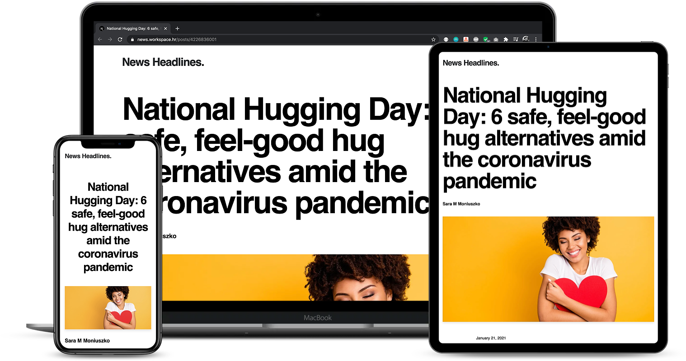

Inspired by [Next.js's example](https://github.com/vercel/next.js/tree/canary/examples/blog-starter) for statically generated blog.

# News Headlines

Get breaking news headlines from all over the web.

## Demo



## How to use

Clone the app and run development server:

```bash
yarn dev
```

Your app should be up and running on [http://localhost:3000](http://localhost:3000)! If it doesn't work, open a [GitHub issue](https://github.com/ilovric00/news-headlines/issues).

## Style Guide

As a "base" style guide, the [Airbnb's style guide](https://airbnb.io/javascript/react) is being used. Since we're applying different eslint configs that are combined with Airbnb's [config](https://yarnpkg.com/package/eslint-config-airbnb), large number of these rules are already enforced.
